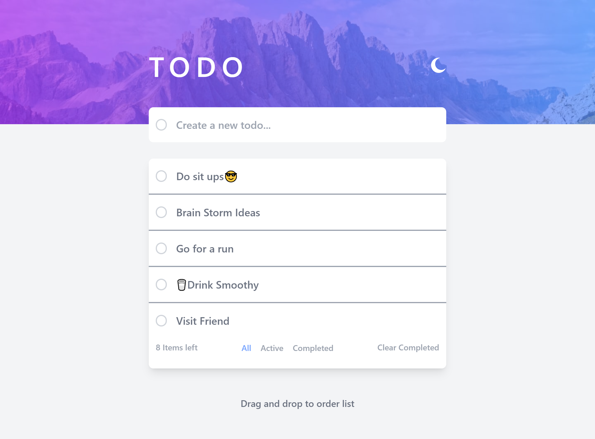

# Frontend Mentor - Todo app solution

This is a solution to the [Todo app challenge on Frontend Mentor](https://www.frontendmentor.io/challenges/todo-app-Su1_KokOW). Frontend Mentor challenges help you improve your coding skills by building realistic projects. 

## Table of contents

- [Overview](#overview)
  - [The challenge](#the-challenge)
  - [Screenshot](#screenshot)
  - [Links](#links)
- [My process](#my-process)
  - [Built with](#built-with)
  - [What I learned](#what-i-learned)
  - [Continued development](#continued-development)
  - [Useful resources](#useful-resources)
- [Author](#author)

## Overview

### The challenge

Users should be able to:

- View the optimal layout for the app depending on their device's screen size
- See hover states for all interactive elements on the page
- Add new todos to the list
- Mark todos as complete
- Delete todos from the list
- Filter by all/active/complete todos
- Clear all completed todos
- Toggle light and dark mode
- **Bonus**: Drag and drop to reorder items on the list

### Screenshot



### Links

- Solution URL: [Add solution URL here](https://github.com/Gito125/to-do-app1234/)
- Live Site URL: [Add live site URL here](https://to-do-app1234.web.app/)

## My process

### Built with

- [React](https://reactjs.org/) - JS library
- Tailwind CSS

### What I learned

Primarily I learnt hpow to drag and drop using react.

To see how you can add code snippets, see below:

```js
const handle_toDoSubmit = (e, input) => {
  e.preventDefault()
  let id = (Math.random()*100000).toFixed(0).toString()
  const newItem = {
    id: `tx${id}`,
    text: input,
    isDone: false,
    time: new Date().getTime()
  }
  initList.unshift(newItem)
  handleActionButtonFilter('Active')
  console.log('TODO ADDED')
}
```

### Continued development

React-States and Hooks plus coding logic

### Useful resources
-W3 Schools

## Author

- Website - [Ogwang Gift Gideon](https://www.iamgideon.carrd.co)
- Frontend Mentor - [@Gito125](https://www.frontendmentor.io/profile/Gito125)
- Twitter - [@Gito](https://www.twitter.com/Gito)